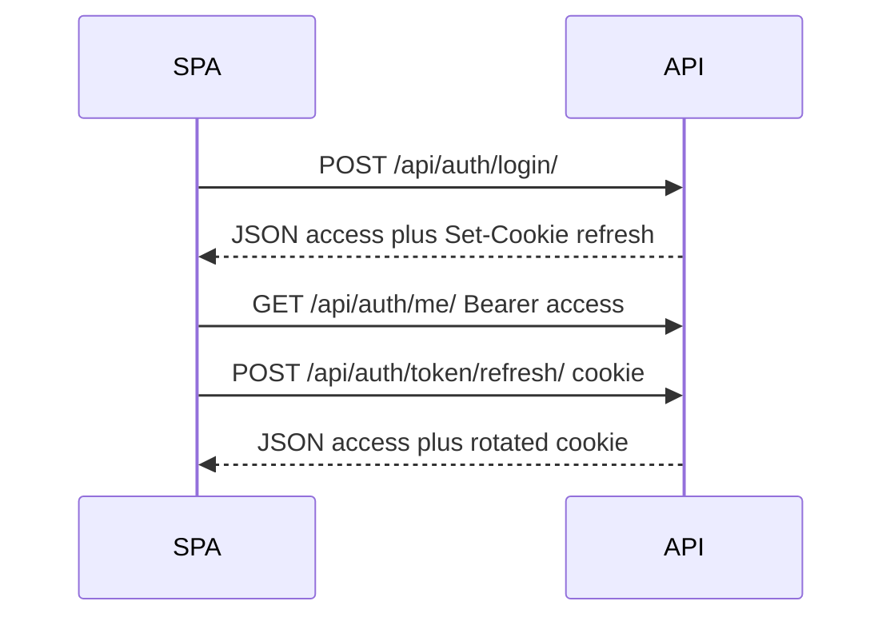

# Frontend guide (React + Vite + TypeScript)

How to build the Inveno web app against this API. Per-endpoint JSON lives in
[`FRONTEND_API.md`](../../FRONTEND_API.md). The **Current endpoints** table below
is generated from the live OpenAPI schema and updates automatically when the API
changes.

Log in at `/admin/` first — this page is staff-only, same as Swagger.

---

## 1. Stack and environment

**Stack:** React 18+, Vite, TypeScript, React Router, Axios.

```bash
npm create vite@latest inveno-web -- --template react-ts
cd inveno-web
npm i axios react-router-dom
```

`.env`:

```env
VITE_API_URL=http://localhost:8000
```

`src/vite-env.d.ts`:

```ts
/// <reference types="vite/client" />

interface ImportMetaEnv {
  readonly VITE_API_URL: string;
}

interface ImportMeta {
  readonly env: ImportMetaEnv;
}
```

**Important**

- The browser must call `http://localhost:8000`, **never** `http://api:8000` (Docker-only hostname).
- All auth calls need **`withCredentials: true`** so the httpOnly refresh cookie is sent.
- Configure `CORS_ALLOWED_ORIGINS` on the API to include your frontend URL.

Development Docker seeds a **demo org** after migrate so every list screen has rows. Password for all accounts: **`DemoPass123!`**.

| Login (email) | Role |
|---|---|
| `super@inveno.local` | super_admin (Swagger / this page / Django Admin) |
| `admin@demo.inveno.local` | central_admin |
| `ops@demo.inveno.local` | operation_incharge |
| `warehouse@demo.inveno.local` | warehouse_manager |
| `space@demo.inveno.local` | space_incharge (North Wing) |

On restart, an attached TTY pauses: **k** keep existing dummy data, **w** wipe the demo org and recreate. `docker compose up -d` keeps existing data. Wipe later with `docker compose exec -it api python manage.py seed_demo --reset`. Set `SEED_DEMO=false` to skip seeding.

Suggested layout:

```
src/
  lib/types.ts
  lib/auth.ts
  lib/errors.ts
  lib/api.ts
  auth/AuthProvider.tsx
  auth/RequireAuth.tsx
  pages/LoginPage.tsx
  pages/GetStartedPage.tsx
  ...
```

---

## 2. Roles and navigation

There is **no public register**. Super admins create organisations and the first
central admin in Django Admin. Central admins add org users via
`POST /api/orgs/members/`.

| `user_type` | Staff? | `org` | Typical UI |
|---|---|---|---|
| `super_admin` | yes | always `null` | Platform admin only |
| `central_admin` | no | required | Full org: members, spaces, vendors, catalog, purchases |
| `operation_incharge` | no | required | Purchase flow; no member/space admin |
| `warehouse_manager` | no | required | Vendors, catalog writes, warehouse receipts |
| `space_incharge` | no | required | PRs for assigned space only |

Use **`GET /api/auth/me/`** as the source of truth for routing. JWT claims are a
hint for first paint only. For space incharges, `profile.space` is
`{ slug, name }` when assigned, otherwise `null`.

**Nav by role**

| Screen | Roles |
|---|---|
| Members / spaces admin | `central_admin` |
| Vendors / items / warehouses | `central_admin`, `operation_incharge`, `warehouse_manager` |
| Purchase requests | `space_incharge` (with space), `operation_incharge`, `central_admin` |
| RFQ / PO / QC / invoice | `operation_incharge`, `central_admin` |
| Warehouse receipts | `warehouse_manager`, `central_admin` |

Hide vendor and catalog screens from `space_incharge`.

---

## 3. Onboarding and password flows

1. Super admin creates org + first central admin in `/admin/`.
2. Central admin adds users with `POST /api/orgs/members/`.
3. Welcome email: `{FRONTEND_URL}/get-started?uid=...&token=...`
4. Get Started page → `POST /api/auth/password/set/` (7-day one-time token).
5. Login → `POST /api/auth/login/` with `withCredentials: true`.
6. Store **access in memory**; refresh is set as httpOnly cookie automatically.

| | Set password (welcome) | Forgot password |
|---|---|---|
| Endpoint | `POST /api/auth/password/set/` | `POST /api/auth/password/reset/` then `.../confirm/` |
| TTL | 7 days | 1 hour |
| One-time | Yes | Yes after confirm |

Do not reuse Get Started tokens on the forgot-password page.

---

## 4. JWT session (httpOnly refresh)

| Token | Lifetime | Storage |
|---|---|---|
| Access | 15 minutes | In-memory → `Authorization: Bearer <access>` |
| Refresh | 7 days | httpOnly cookie `inveno_refresh`, `Path=/api/auth/` |

- Login returns `{ "access": "..." }` only; refresh arrives via `Set-Cookie`.
- Refresh rotates: `POST /api/auth/token/refresh/` with credentials, **empty body**.
- Logout: `POST /api/auth/logout/` with credentials; cookie cleared.
- Password change revokes all refresh tokens and clears the cookie.
- Never store tokens in `localStorage` or `sessionStorage`.



---

## 5. TypeScript types

`src/lib/types.ts`:

```ts
export type UserType =
  | "super_admin"
  | "central_admin"
  | "operation_incharge"
  | "warehouse_manager"
  | "space_incharge";

export type OrgAssignableUserType =
  | "central_admin"
  | "operation_incharge"
  | "warehouse_manager"
  | "space_incharge";

export type AccessTokenResponse = {
  access: string;
};

export type MeResponse = {
  id: string;
  email: string;
  date_joined: string;
  updated_at: string;
  profile: {
    user_type: UserType;
    first_name: string;
    last_name: string;
    phone: string;
    full_name: string;
    space: { slug: string; name: string } | null;
  } | null;
  org: {
    id: string;
    name: string;
    org_suffix: string;
    location: string;
    is_active: boolean;
    registered_on: string;
  } | null;
};

export type Paginated<T> = {
  count: number;
  next: string | null;
  previous: string | null;
  results: T[];
};

export type OrgMember = {
  slug: string;
  email: string;
  user_type: OrgAssignableUserType;
  first_name: string;
  last_name: string;
  phone: string;
  full_name: string;
  is_active: boolean;
  has_usable_password: boolean;
  date_joined: string;
  space: { slug: string; name: string } | null;
};

export type Space = {
  slug: string;
  name: string;
  location: string;
  is_active: boolean;
  created_at: string;
  updated_at: string;
};

export type Vendor = {
  slug: string;
  name: string;
  contact_name: string;
  phone: string;
  email: string;
  address: string;
  gst: string;
  website: string;
  is_active: boolean;
  created_at: string;
  updated_at: string;
};

export type VendorWrite = {
  name: string;
  contact_name: string;
  phone: string;
  address: string;
  email?: string;
  gst?: string;
  website?: string;
};

export type Warehouse = {
  slug: string;
  name: string;
  location: string;
  is_active: boolean;
  created_at: string;
  updated_at: string;
};

export type WarehouseWrite = {
  name: string;
  location?: string;
  is_active?: boolean;
};

export type ItemCategory = {
  slug: string;
  name: string;
  is_active: boolean;
  created_at: string;
  updated_at: string;
};

export type ItemPhoto = {
  slug: string;
  url: string;
};

export type Item = {
  slug: string;
  warehouse: string;
  name: string;
  description: string;
  part_number: string;
  alternate_part_number: string;
  unit: string;
  category: string | null;
  location: string;
  remarks: string;
  quantity_on_hand: string;
  balance_in_stock: string;
  last_purchase_date: string | null;
  last_purchase_quantity: string | null;
  photos: ItemPhoto[];
  is_active: boolean;
  created_at: string;
  updated_at: string;
};

export type ItemWrite = {
  warehouse: string;
  name: string;
  unit: string;
  description?: string;
  part_number?: string;
  alternate_part_number?: string;
  category?: string | null;
  location?: string;
  remarks?: string;
  last_purchase_date?: string | null;
  last_purchase_quantity?: string | null;
};

export type PurchaseRequestLine = {
  slug: string;
  description: string;
  quantity: string;
  unit: string;
  item: string | null;
  awarded_vendor: string | null;
};

export type PurchaseRequest = {
  slug: string;
  title: string;
  status: "draft" | "submitted" | "approved" | "revision_requested" | "declined";
  notes: string;
  space: string | null;
  created_by: string;
  review_reason: string;
  lines: PurchaseRequestLine[];
  created_at: string;
  updated_at: string;
};

export type PurchaseRequestWrite = {
  title: string;
  notes?: string;
  space?: string | null;
  lines: { description: string; quantity: string; unit: string; item?: string }[];
};

export type RFQVendor = {
  vendor: string;
  status: string;
  reject_reason: string;
};

export type RFQLineQuote = {
  vendor: string;
  unit_price: string;
};

export type RFQLine = {
  slug: string;
  description: string;
  quantity: string;
  unit: string;
  awarded_vendor: string | null;
  quotes: RFQLineQuote[];
};

export type QuoteRequest = {
  slug: string;
  purchase_request: string;
  status: string;
  notes: string;
  vendors: RFQVendor[];
  lines: RFQLine[];
  created_at: string;
  updated_at: string;
};

export type PurchaseOrderLine = {
  slug: string;
  description: string;
  quantity: string;
  unit: string;
  unit_price: string;
};

export type PurchaseOrder = {
  slug: string;
  vendor: string;
  purchase_request: string;
  status: string;
  is_new_order: boolean;
  lines: PurchaseOrderLine[];
  created_at: string;
  updated_at: string;
};

export type PurchaseInvoice = {
  slug: string;
  notes: string;
  document_urls: string[];
  status: string;
  created_at: string;
};

export type WarehouseReceiptSuggestedItem = {
  slug: string;
  name: string;
  part_number: string;
  unit: string;
  quantity_on_hand: string;
};

export type WarehouseReceiptLine = {
  slug: string;
  description: string;
  quantity: string;
  unit: string;
  item: string | null;
  source_item: string | null;
  suggested_items: WarehouseReceiptSuggestedItem[];
};

export type WarehouseReceipt = {
  slug: string;
  purchase_order: string;
  warehouse: string | null;
  status: string;
  lines: WarehouseReceiptLine[];
  created_at: string;
  completed_at: string | null;
};

export type ProcessEvent = {
  slug: string;
  action: string;
  actor_slug: string;
  actor_user_type: string;
  resource_type: string;
  resource_slug: string;
  content_hash: string;
  signature: string;
  prev_hash: string;
  created_at: string;
};
```

---

## 6. Access token module

`src/lib/auth.ts` — memory only:

```ts
let accessToken: string | null = null;

export function getAccessToken(): string | null {
  return accessToken;
}

export function setAccessToken(token: string | null): void {
  accessToken = token;
}

export function clearAccessToken(): void {
  accessToken = null;
}
```

---

## 7. Error helper

`src/lib/errors.ts`:

```ts
import type { AxiosError } from "axios";

export function formatApiError(error: unknown): string {
  const ax = error as AxiosError<Record<string, unknown>>;
  const data = ax.response?.data;
  if (!data) return ax.message || "Request failed";

  if (typeof data.detail === "string") return data.detail;

  if (Array.isArray(data.non_field_errors)) {
    return (data.non_field_errors as string[]).join(" ");
  }

  const parts: string[] = [];
  for (const [field, msgs] of Object.entries(data)) {
    if (Array.isArray(msgs)) parts.push(`${field}: ${(msgs as string[]).join(", ")}`);
  }
  return parts.join("; ") || "Request failed";
}

export function retryAfterSeconds(error: unknown): number | null {
  const ax = error as AxiosError;
  const header = ax.response?.headers?.["retry-after"];
  if (!header) return null;
  const n = parseInt(String(header), 10);
  return Number.isFinite(n) ? n : null;
}
```

On **403** show a permission banner — do not attempt token refresh.

---

## 8. Axios client and API helpers

`src/lib/api.ts` — full client covering every product endpoint:

```ts
import axios, { AxiosError, InternalAxiosRequestConfig } from "axios";
import { clearAccessToken, getAccessToken, setAccessToken } from "./auth";
import type {
  AccessTokenResponse,
  Item,
  ItemCategory,
  ItemPhoto,
  ItemWrite,
  MeResponse,
  OrgAssignableUserType,
  OrgMember,
  Paginated,
  ProcessEvent,
  PurchaseInvoice,
  PurchaseOrder,
  PurchaseRequest,
  PurchaseRequestWrite,
  QuoteRequest,
  Space,
  Vendor,
  VendorWrite,
  Warehouse,
  WarehouseReceipt,
  WarehouseReceiptLine,
  WarehouseWrite,
} from "./types";

const baseURL = import.meta.env.VITE_API_URL;

export const api = axios.create({
  baseURL,
  withCredentials: true,
  headers: { "Content-Type": "application/json" },
});

const PUBLIC_AUTH_PATHS = [
  "/api/auth/login/",
  "/api/auth/password/set/",
  "/api/auth/password/reset/",
  "/api/auth/password/reset/confirm/",
];

api.interceptors.request.use((config) => {
  const access = getAccessToken();
  if (access) config.headers.Authorization = `Bearer ${access}`;
  return config;
});

let refreshing: Promise<string> | null = null;

api.interceptors.response.use(
  (res) => res,
  async (error: AxiosError) => {
    const original = error.config as InternalAxiosRequestConfig & { _retry?: boolean };
    const status = error.response?.status;
    const url = original?.url ?? "";

    if (
      status === 401 &&
      original &&
      !original._retry &&
      !PUBLIC_AUTH_PATHS.some((p) => url.includes(p))
    ) {
      original._retry = true;
      try {
        if (!refreshing) {
          refreshing = axios
            .post<AccessTokenResponse>(`${baseURL}/api/auth/token/refresh/`, {}, {
              withCredentials: true,
            })
            .then((r) => {
              setAccessToken(r.data.access);
              return r.data.access;
            })
            .finally(() => {
              refreshing = null;
            });
        }
        const access = await refreshing;
        original.headers.Authorization = `Bearer ${access}`;
        return api(original);
      } catch {
        clearAccessToken();
        window.location.assign("/login");
        return Promise.reject(error);
      }
    }
    return Promise.reject(error);
  },
);

// ── Auth ─────────────────────────────────────────────────────────────────────

export async function login(email: string, password: string) {
  const { data } = await api.post<AccessTokenResponse>("/api/auth/login/", {
    email,
    password,
  });
  setAccessToken(data.access);
  return data;
}

export async function silentRefresh() {
  const { data } = await api.post<AccessTokenResponse>("/api/auth/token/refresh/");
  setAccessToken(data.access);
  return data;
}

export async function logout() {
  try {
    await api.post("/api/auth/logout/");
  } finally {
    clearAccessToken();
  }
}

export async function getMe() {
  const { data } = await api.get<MeResponse>("/api/auth/me/");
  return data;
}

export async function patchMe(body: {
  first_name?: string;
  last_name?: string;
  phone?: string;
}) {
  const { data } = await api.patch<MeResponse>("/api/auth/me/", body);
  return data;
}

export async function changePassword(body: {
  old_password: string;
  new_password: string;
  new_password2: string;
}) {
  const { data } = await api.post<{ detail: string }>("/api/auth/password/change/", body);
  clearAccessToken();
  return data;
}

export async function setPassword(body: {
  uid: string;
  token: string;
  new_password: string;
  new_password2: string;
}) {
  const { data } = await api.post<{ detail: string }>("/api/auth/password/set/", body);
  return data;
}

export async function forgotPassword(email: string) {
  const { data } = await api.post<{ detail: string }>("/api/auth/password/reset/", { email });
  return data;
}

export async function resetPasswordConfirm(body: {
  uid: string;
  token: string;
  new_password: string;
  new_password2: string;
}) {
  const { data } = await api.post<{ detail: string }>(
    "/api/auth/password/reset/confirm/",
    body,
  );
  return data;
}

// ── Members ──────────────────────────────────────────────────────────────────

export async function listOrgMembers(status?: "active" | "suspended") {
  const { data } = await api.get<Paginated<OrgMember>>("/api/orgs/members/", {
    params: status ? { status } : undefined,
  });
  return data;
}

export async function addOrgMember(body: {
  email: string;
  first_name: string;
  last_name: string;
  phone?: string;
  user_type: OrgAssignableUserType;
}) {
  const { data } = await api.post<OrgMember>("/api/orgs/members/", body);
  return data;
}

export async function resendWelcome(slug: string) {
  const { data } = await api.post<{ detail: string }>(
    `/api/orgs/members/${slug}/resend-welcome/`,
  );
  return data;
}

export async function suspendMember(slug: string) {
  const { data } = await api.post<{ detail: string }>(
    `/api/orgs/members/${slug}/suspend/`,
  );
  return data;
}

export async function unsuspendMember(slug: string) {
  const { data } = await api.post<{ detail: string }>(
    `/api/orgs/members/${slug}/unsuspend/`,
  );
  return data;
}

// ── Spaces ───────────────────────────────────────────────────────────────────

export async function listSpaces(status?: "active" | "suspended") {
  const { data } = await api.get<Paginated<Space>>("/api/orgs/spaces/", {
    params: status ? { status } : undefined,
  });
  return data;
}

export async function createSpace(body: { name: string; location?: string }) {
  const { data } = await api.post<Space>("/api/orgs/spaces/", body);
  return data;
}

export async function getSpace(slug: string) {
  const { data } = await api.get<Space>(`/api/orgs/spaces/${slug}/`);
  return data;
}

export async function updateSpace(slug: string, body: Partial<{ name: string; location: string }>) {
  const { data } = await api.patch<Space>(`/api/orgs/spaces/${slug}/`, body);
  return data;
}

export async function suspendSpace(slug: string) {
  const { data } = await api.post<{ detail: string }>(`/api/orgs/spaces/${slug}/suspend/`);
  return data;
}

export async function unsuspendSpace(slug: string) {
  const { data } = await api.post<{ detail: string }>(`/api/orgs/spaces/${slug}/unsuspend/`);
  return data;
}

export async function listSpaceIncharges(spaceSlug: string) {
  const { data } = await api.get<OrgMember[]>(`/api/orgs/spaces/${spaceSlug}/incharges/`);
  return data;
}

export async function assignSpaceIncharge(spaceSlug: string, member: string) {
  const { data } = await api.post<OrgMember>(
    `/api/orgs/spaces/${spaceSlug}/incharges/`,
    { member },
  );
  return data;
}

export async function unassignSpaceIncharge(spaceSlug: string, memberSlug: string) {
  const { data } = await api.post<{ detail: string }>(
    `/api/orgs/spaces/${spaceSlug}/incharges/${memberSlug}/unassign/`,
  );
  return data;
}

// ── Vendors ──────────────────────────────────────────────────────────────────

export async function listVendors(status?: "active" | "suspended") {
  const { data } = await api.get<Paginated<Vendor>>("/api/orgs/vendors/", {
    params: status ? { status } : undefined,
  });
  return data;
}

export async function addVendor(body: VendorWrite) {
  const { data } = await api.post<Vendor>("/api/orgs/vendors/", body);
  return data;
}

export async function getVendor(slug: string) {
  const { data } = await api.get<Vendor>(`/api/orgs/vendors/${slug}/`);
  return data;
}

export async function updateVendor(slug: string, body: Partial<VendorWrite>) {
  const { data } = await api.patch<Vendor>(`/api/orgs/vendors/${slug}/`, body);
  return data;
}

export async function suspendVendor(slug: string) {
  const { data } = await api.post<{ detail: string }>(`/api/orgs/vendors/${slug}/suspend/`);
  return data;
}

export async function unsuspendVendor(slug: string) {
  const { data } = await api.post<{ detail: string }>(`/api/orgs/vendors/${slug}/unsuspend/`);
  return data;
}

// ── Warehouses ───────────────────────────────────────────────────────────────

export async function listWarehouses(status?: "active" | "suspended") {
  const { data } = await api.get<Paginated<Warehouse>>("/api/orgs/warehouses/", {
    params: status ? { status } : undefined,
  });
  return data;
}

export async function createWarehouse(body: WarehouseWrite) {
  const { data } = await api.post<Warehouse>("/api/orgs/warehouses/", body);
  return data;
}

export async function getWarehouse(slug: string) {
  const { data } = await api.get<Warehouse>(`/api/orgs/warehouses/${slug}/`);
  return data;
}

export async function updateWarehouse(slug: string, body: Partial<WarehouseWrite>) {
  const { data } = await api.patch<Warehouse>(`/api/orgs/warehouses/${slug}/`, body);
  return data;
}

// ── Item categories ──────────────────────────────────────────────────────────

export async function listItemCategories() {
  const { data } = await api.get<Paginated<ItemCategory>>("/api/orgs/item-categories/");
  return data;
}

export async function createItemCategory(body: { name: string }) {
  const { data } = await api.post<ItemCategory>("/api/orgs/item-categories/", body);
  return data;
}

export async function updateItemCategory(
  slug: string,
  body: { name?: string; is_active?: boolean },
) {
  const { data } = await api.patch<ItemCategory>(
    `/api/orgs/item-categories/${slug}/`,
    body,
  );
  return data;
}

// ── Items ────────────────────────────────────────────────────────────────────

export async function listItems(params?: {
  status?: "active" | "suspended";
  warehouse?: string;
  page?: number;
}) {
  const { data } = await api.get<Paginated<Item>>("/api/orgs/items/", { params });
  return data;
}

export async function createItem(body: ItemWrite) {
  const { data } = await api.post<Item>("/api/orgs/items/", body);
  return data;
}

export async function getItem(slug: string) {
  const { data } = await api.get<Item>(`/api/orgs/items/${slug}/`);
  return data;
}

export async function updateItem(slug: string, body: Partial<ItemWrite>) {
  const { data } = await api.patch<Item>(`/api/orgs/items/${slug}/`, body);
  return data;
}

export async function suspendItem(slug: string) {
  const { data } = await api.post<{ detail: string }>(`/api/orgs/items/${slug}/suspend/`);
  return data;
}

export async function unsuspendItem(slug: string) {
  const { data } = await api.post<{ detail: string }>(`/api/orgs/items/${slug}/unsuspend/`);
  return data;
}

export async function createItemPhoto(itemSlug: string, file: File) {
  const form = new FormData();
  form.append("image", file);
  const { data } = await api.post<ItemPhoto>(
    `/api/orgs/items/${itemSlug}/photos/`,
    form,
    { headers: { "Content-Type": "multipart/form-data" } },
  );
  return data;
}

export async function deleteItemPhoto(itemSlug: string, photoSlug: string) {
  await api.delete(`/api/orgs/items/${itemSlug}/photos/${photoSlug}/`);
}

// ── Purchase requests ────────────────────────────────────────────────────────

export async function listPurchaseRequests(params?: { page?: number }) {
  const { data } = await api.get<Paginated<PurchaseRequest>>("/api/orgs/purchase-requests/", {
    params,
  });
  return data;
}

export async function createPurchaseRequest(body: PurchaseRequestWrite) {
  const { data } = await api.post<PurchaseRequest>("/api/orgs/purchase-requests/", body);
  return data;
}

export async function getPurchaseRequest(slug: string) {
  const { data } = await api.get<PurchaseRequest>(`/api/orgs/purchase-requests/${slug}/`);
  return data;
}

export async function updatePurchaseRequest(slug: string, body: Partial<PurchaseRequestWrite>) {
  const { data } = await api.patch<PurchaseRequest>(
    `/api/orgs/purchase-requests/${slug}/`,
    body,
  );
  return data;
}

export async function submitPurchaseRequest(slug: string) {
  const { data } = await api.post<PurchaseRequest>(
    `/api/orgs/purchase-requests/${slug}/submit/`,
  );
  return data;
}

export async function approvePurchaseRequest(slug: string) {
  const { data } = await api.post<PurchaseRequest>(
    `/api/orgs/purchase-requests/${slug}/approve/`,
  );
  return data;
}

export async function declinePurchaseRequest(slug: string, reason: string) {
  const { data } = await api.post<PurchaseRequest>(
    `/api/orgs/purchase-requests/${slug}/decline/`,
    { reason },
  );
  return data;
}

export async function requestPurchaseRevision(slug: string, reason: string) {
  const { data } = await api.post<PurchaseRequest>(
    `/api/orgs/purchase-requests/${slug}/request-revision/`,
    { reason },
  );
  return data;
}

export async function getPurchaseRequestTrail(slug: string) {
  const { data } = await api.get<ProcessEvent[]>(
    `/api/orgs/purchase-requests/${slug}/trail/`,
  );
  return data;
}

// ── RFQs ─────────────────────────────────────────────────────────────────────

export async function listRfqs(params?: { page?: number }) {
  const { data } = await api.get<Paginated<QuoteRequest>>("/api/orgs/rfqs/", { params });
  return data;
}

export async function createRfq(body: { purchase_request: string; vendor_slugs: string[] }) {
  const { data } = await api.post<QuoteRequest>("/api/orgs/rfqs/", body);
  return data;
}

export async function getRfq(slug: string) {
  const { data } = await api.get<QuoteRequest>(`/api/orgs/rfqs/${slug}/`);
  return data;
}

export async function addRfqVendor(rfqSlug: string, vendor: string) {
  const { data } = await api.post(`/api/orgs/rfqs/${rfqSlug}/vendors/`, { vendor });
  return data;
}

export async function rejectRfqVendor(rfqSlug: string, vendorSlug: string, reason: string) {
  const { data } = await api.post(
    `/api/orgs/rfqs/${rfqSlug}/vendors/${vendorSlug}/reject/`,
    { reason },
  );
  return data;
}

export async function recordQuote(
  rfqSlug: string,
  body: {
    vendor: string;
    notes?: string;
    lines: { line: string; unit_price: string }[];
  },
) {
  const { data } = await api.post(`/api/orgs/rfqs/${rfqSlug}/quotes/`, body);
  return data;
}

export async function requestRfqRevision(rfqSlug: string, reason: string) {
  const { data } = await api.post(`/api/orgs/rfqs/${rfqSlug}/request-revision/`, { reason });
  return data;
}

export async function selectQuoteLines(
  rfqSlug: string,
  selections: { line: string; vendor: string }[],
) {
  const { data } = await api.post(`/api/orgs/rfqs/${rfqSlug}/select-lines/`, {
    selections,
  });
  return data;
}

export async function createPurchaseOrderFromRfq(
  rfqSlug: string,
  body: { vendor: string; create_purchase_order?: boolean },
) {
  const { data } = await api.post<PurchaseOrder>(
    `/api/orgs/rfqs/${rfqSlug}/purchase-orders/`,
    body,
  );
  return data;
}

// ── Purchase orders ──────────────────────────────────────────────────────────

export async function listPurchaseOrders(params?: { page?: number }) {
  const { data } = await api.get<Paginated<PurchaseOrder>>("/api/orgs/purchase-orders/", {
    params,
  });
  return data;
}

export async function getPurchaseOrder(slug: string) {
  const { data } = await api.get<PurchaseOrder>(`/api/orgs/purchase-orders/${slug}/`);
  return data;
}

export async function submitQualityCheck(
  poSlug: string,
  body: {
    passed: boolean;
    reason?: string;
    next?: "" | "return" | "reorder_same" | "choose_vendors";
  },
) {
  const { data } = await api.post(`/api/orgs/purchase-orders/${poSlug}/quality-check/`, body);
  return data;
}

export async function submitInvoice(
  poSlug: string,
  body: { notes?: string; document_urls?: string[] },
) {
  const { data } = await api.post<PurchaseInvoice>(
    `/api/orgs/purchase-orders/${poSlug}/invoice/`,
    body,
  );
  return data;
}

// ── Warehouse receipts ───────────────────────────────────────────────────────

export async function listWarehouseReceipts(params?: { page?: number }) {
  const { data } = await api.get<Paginated<WarehouseReceipt>>(
    "/api/orgs/warehouse/receipts/",
    { params },
  );
  return data;
}

export async function getWarehouseReceipt(slug: string) {
  const { data } = await api.get<WarehouseReceipt>(
    `/api/orgs/warehouse/receipts/${slug}/`,
  );
  return data;
}

export async function completeWarehouseReceipt(
  slug: string,
  body: {
    warehouse?: string;
    lines: {
      line: string;
      action: "new_item" | "add_to_existing";
      item?: string;
      name?: string;
      part_number?: string;
      unit?: string;
    }[];
  },
) {
  const { data } = await api.post<WarehouseReceipt>(
    `/api/orgs/warehouse/receipts/${slug}/complete/`,
    body,
  );
  return data;
}

/** Map one pending line after the user chooses add-stock vs create-new. */
export function receiptLineAction(
  line: WarehouseReceiptLine,
  addToExisting: boolean,
) {
  if (addToExisting && line.suggested_items[0]) {
    return {
      line: line.slug,
      action: "add_to_existing" as const,
      item: line.suggested_items[0].slug,
    };
  }
  return {
    line: line.slug,
    action: "new_item" as const,
    name: line.description,
    unit: line.unit,
  };
}

// ── Process trail verify ─────────────────────────────────────────────────────

export async function verifyProcessEvent(content_hash: string, signature: string) {
  const { data } = await api.post<{ valid: boolean }>(
    "/api/orgs/process-events/verify/",
    { content_hash, signature },
  );
  return data;
}

// ── Authenticated exports (Bearer required; cookie not sent on these paths) ──

export async function downloadExport(
  path: string,
  filename: string,
): Promise<void> {
  const { data } = await api.get(path, { responseType: "blob" });
  const url = URL.createObjectURL(data);
  const a = document.createElement("a");
  a.href = url;
  a.download = filename;
  a.click();
  URL.revokeObjectURL(url);
}

export function exportPath(
  kind: "purchase-requests" | "rfqs" | "purchase-orders" | "warehouse/receipts",
  slug: string,
  format: "pdf" | "xlsx",
  invoice = false,
) {
  if (invoice) {
    return `/api/orgs/purchase-orders/${slug}/invoice/export/?format=${format}`;
  }
  return `/api/orgs/${kind}/${slug}/export/?format=${format}`;
}
```

Skip the interceptor refresh for `/api/auth/token/refresh/` itself — the snippet
uses a bare `axios.post` for that reason.

---

## 9. AuthProvider (bootstrap)

`src/auth/AuthProvider.tsx`:

```tsx
import {
  createContext,
  useCallback,
  useContext,
  useEffect,
  useMemo,
  useState,
  type ReactNode,
} from "react";
import { getMe, login as apiLogin, logout as apiLogout, silentRefresh } from "../lib/api";
import { clearAccessToken, getAccessToken } from "../lib/auth";
import type { MeResponse } from "../lib/types";

type AuthContextValue = {
  me: MeResponse | null;
  ready: boolean;
  login: (email: string, password: string) => Promise<void>;
  logout: () => Promise<void>;
  refreshMe: () => Promise<void>;
};

const AuthContext = createContext<AuthContextValue | null>(null);

export function AuthProvider({ children }: { children: ReactNode }) {
  const [me, setMe] = useState<MeResponse | null>(null);
  const [ready, setReady] = useState(false);

  const refreshMe = useCallback(async () => {
    const profile = await getMe();
    setMe(profile);
  }, []);

  useEffect(() => {
    (async () => {
      try {
        if (!getAccessToken()) await silentRefresh();
        await refreshMe();
      } catch {
        clearAccessToken();
        setMe(null);
      } finally {
        setReady(true);
      }
    })();
  }, [refreshMe]);

  const login = useCallback(
    async (email: string, password: string) => {
      await apiLogin(email, password);
      await refreshMe();
    },
    [refreshMe],
  );

  const logout = useCallback(async () => {
    await apiLogout();
    setMe(null);
  }, []);

  const value = useMemo(
    () => ({ me, ready, login, logout, refreshMe }),
    [me, ready, login, logout, refreshMe],
  );

  return <AuthContext.Provider value={value}>{children}</AuthContext.Provider>;
}

export function useAuth() {
  const ctx = useContext(AuthContext);
  if (!ctx) throw new Error("useAuth must be used within AuthProvider");
  return ctx;
}
```

Wrap your app:

```tsx
// main.tsx
import { BrowserRouter } from "react-router-dom";
import { AuthProvider } from "./auth/AuthProvider";

createRoot(document.getElementById("root")!).render(
  <BrowserRouter>
    <AuthProvider>
      <App />
    </AuthProvider>
  </BrowserRouter>,
);
```

---

## 10. Route guard

`src/auth/RequireAuth.tsx`:

```tsx
import { Navigate, Outlet } from "react-router-dom";
import { useAuth } from "./AuthProvider";
import type { UserType } from "../lib/types";

const ORG_ROLES: UserType[] = [
  "central_admin",
  "operation_incharge",
  "warehouse_manager",
  "space_incharge",
];

export function RequireAuth({
  orgOnly = false,
  centralAdminOnly = false,
  requireSpace = false,
}: {
  orgOnly?: boolean;
  centralAdminOnly?: boolean;
  requireSpace?: boolean;
}) {
  const { me, ready } = useAuth();

  if (!ready) return null;
  if (!me) return <Navigate to="/login" replace />;

  const role = me.profile?.user_type;

  if (orgOnly) {
    if (!role || !ORG_ROLES.includes(role)) {
      return <Navigate to="/" replace />;
    }
    if (!me.org?.is_active) {
      return <p>Your organisation has been suspended.</p>;
    }
  }

  if (centralAdminOnly && role !== "central_admin") {
    return <Navigate to="/" replace />;
  }

  if (requireSpace && !me.profile?.space) {
    return <p>No space assigned yet. Contact your central admin.</p>;
  }

  return <Outlet context={{ me }} />;
}
```

---

## 11. Screen examples

### Login

```tsx
import { FormEvent, useState } from "react";
import { useNavigate } from "react-router-dom";
import { useAuth } from "../auth/AuthProvider";
import { formatApiError } from "../lib/errors";

export function LoginPage() {
  const { login } = useAuth();
  const navigate = useNavigate();
  const [email, setEmail] = useState("");
  const [password, setPassword] = useState("");
  const [error, setError] = useState("");

  async function onSubmit(e: FormEvent) {
    e.preventDefault();
    setError("");
    try {
      await login(email, password);
      navigate("/");
    } catch (err) {
      setError(formatApiError(err));
    }
  }

  return (
    <form onSubmit={onSubmit}>
      {error ? <p>{error}</p> : null}
      <input type="email" value={email} onChange={(e) => setEmail(e.target.value)} />
      <input type="password" value={password} onChange={(e) => setPassword(e.target.value)} />
      <button type="submit">Log in</button>
    </form>
  );
}
```

### Get Started (`/get-started?uid=...&token=...`)

```tsx
import { FormEvent, useState } from "react";
import { useNavigate, useSearchParams } from "react-router-dom";
import { setPassword } from "../lib/api";
import { formatApiError } from "../lib/errors";

export function GetStartedPage() {
  const [params] = useSearchParams();
  const navigate = useNavigate();
  const uid = params.get("uid") ?? "";
  const token = params.get("token") ?? "";
  const [new_password, setNew] = useState("");
  const [new_password2, setNew2] = useState("");
  const [error, setError] = useState("");

  async function onSubmit(e: FormEvent) {
    e.preventDefault();
    setError("");
    try {
      await setPassword({ uid, token, new_password, new_password2 });
      navigate("/login");
    } catch (err) {
      setError(formatApiError(err));
    }
  }

  return (
    <form onSubmit={onSubmit}>
      {error ? <p>{error}</p> : null}
      <input type="password" value={new_password} onChange={(e) => setNew(e.target.value)} />
      <input type="password" value={new_password2} onChange={(e) => setNew2(e.target.value)} />
      <button type="submit">Set password</button>
    </form>
  );
}
```

### Forgot password + reset confirm

Use `forgotPassword(email)` then `/reset-password?uid=...&token=...` with
`resetPasswordConfirm({ uid, token, new_password, new_password2 })`.
Confirming a reset blacklists outstanding refresh tokens; the user must log in
again.

### Change password

After success the API clears the refresh cookie — redirect to `/login`:

```tsx
await changePassword({ old_password, new_password, new_password2 });
navigate("/login");
```

### Complete warehouse receipt

`GET` pending lines include `suggested_items`. If that array is non-empty, ask
whether to add stock to the match or create a new catalog item. If empty, only
offer create-new. Then `POST` complete with **every** line.

```tsx
const receipt = await getWarehouseReceipt(slug);
const lines = receipt.lines.map((line) => {
  const addToExisting =
    line.suggested_items.length > 0 &&
    window.confirm(
      `${line.suggested_items[0].name} already exists in this warehouse. Add stock to it?`,
    );
  return receiptLineAction(line, addToExisting);
});
await completeWarehouseReceipt(receipt.slug, {
  warehouse: receipt.warehouse ?? undefined,
  lines,
});
```

---

## 12. Pagination

List endpoints return:

```json
{
  "count": 42,
  "next": "http://localhost:8000/api/orgs/vendors/?page=2",
  "previous": null,
  "results": []
}
```

Pass `?page=2` and optional `?status=active|suspended` where supported.

---

## 13. Authorization errors

| Status | Meaning | Client action |
|---|---|---|
| `401` | Not logged in or access expired | Silent refresh once; then `/login` |
| `403` | Logged in but not allowed | Show message — **do not** refresh |
| `429` | Rate limited | Read `Retry-After` header (seconds) |

If the org is suspended, login returns `400`:

```json
{
  "non_field_errors": [
    "Your organisation has been suspended. Please contact your administrator."
  ]
}
```

Gate org UI with any org-assignable `user_type` and `org?.is_active`.

---

## 14. Checklist

1. `VITE_API_URL` points at the public API host (not Docker internal names).
2. Axios uses `withCredentials: true`.
3. Access token lives in memory only (`src/lib/auth.ts`).
4. App boot calls `silentRefresh()` then `getMe()`.
5. 401 → one refresh attempt; 403 → permission UI, not refresh.
6. Public resources use **slug**, never UUID, in URLs and payloads.
7. No public self-registration — users come from org member API or admin.
8. PDF/XLSX downloads use `responseType: 'blob'` with Bearer — not plain `<a href>`.
9. Change password, forgot-password confirm, and logout revoke refresh sessions; the user must log in again after a password change or reset.

Per-endpoint request and response JSON: see [`FRONTEND_API.md`](../../FRONTEND_API.md).
